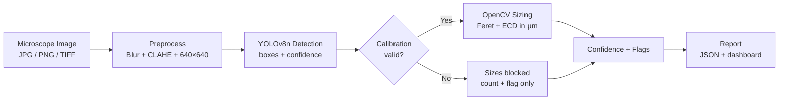

# Hydro Lens — Portable Microplastics Screening System

A React + Vite + Tailwind CSS frontend and FastAPI backend for **Hydro Lens**, an automated optical screening pipeline for microplastic particle detection, sizing, calibration, and sample confidence assessment.

---

## Quick Start

### 1. Backend Service (FastAPI)
The FastAPI service wraps the Python pipeline in `src/` without modifying any algorithm signatures.

```bash
# Install Python dependencies (includes fastapi, uvicorn, python-multipart)
pip install -r requirements.txt

# Run backend API server on port 8000
python -m uvicorn api.main:app --host 127.0.0.1 --port 8000 --reload

# Or use the start/stop helper
./start.sh          # start   (./start.sh stop | restart)
```

The API health check will be available at: [http://localhost:8000/api/health](http://localhost:8000/api/health)

### 2. Frontend Web Application (React + Vite + Tailwind CSS v4)
The frontend provides a clinical-lab Soft Pastel Blue Flat UI matching the Stitch design system.

```bash
# Install Node dependencies (from the repo root — this is what Railway builds)
npm install

# Start Vite development server on port 5173 (proxies /api to :8000)
npm run dev
```

Open your browser at: [http://localhost:5173](http://localhost:5173)

`frontend/` holds a second copy of the same app for standalone work; production builds from the repo root.

---

## Deployment (Railway)

**Live:** https://hydro-lens-production.up.railway.app

One service serves both the API and the built SPA. Build config lives in `railpack.json`:

| Step | Command |
|------|---------|
| packages | Python 3.13 + Node 22 |
| install | `pip install -r requirements.txt` |
| build | `npm ci && npm run build` → `dist/` |
| deploy apt | `libgl1 libglib2.0-0 libxcb1 libxext6 libxrender1` (OpenCV) |
| start | `uvicorn api.main:app --host 0.0.0.0 --port $PORT` |

`api/main.py` serves `dist/` at `/` with an SPA fallback, so `/`, `/analyze` and `/api/*` all resolve on one origin — no CORS config needed. Pushing to `main` triggers a deploy.

---

## 🧪 Running Unit Tests & Fallback Demo

### Python Backend Unit Tests
```bash
pip install pytest
python -m pytest tests/test_backend.py
```

### Streamlit Fallback Demo (Legacy App)
`app.py` remains untouched as the live demo fallback path:
```bash
streamlit run app.py
```

---

## System at a Glance

| Component | Technology | Purpose |
|-----------|------------|---------|
| Detection | YOLOv8n (fine-tuned) | Bounding-box object detection |
| Sizing | OpenCV (Feret's diameter, ECD) | Physical size estimation |
| Preprocessing | Median blur + CLAHE | Denoising + contrast enhancement |
| UI | React + Vite | Image upload → results dashboard |
| Calibration | Stage micrometer + reference beads | Pixel-to-µm mapping |

### Pipeline at a Glance



---

## Key Results (Target)

- **Detection range:** 10 µm – 5 mm (validated via calibration)
- **Inference time:** < 2 sec/image on CPU (Raspberry Pi 4 / laptop)
- **Model size:** ~6 MB (YOLOv8n)
- **Confidence reporting:** Per-particle + aggregate sample confidence
- **Calibration requirement:** Mandatory before quantitative reporting

---

## When a Sample Is Flagged for Lab Confirmation

`flag_lab_confirmation` is `false` only if **every** rule below stays quiet (`src/confidence.py`). All thresholds live in `config.yaml`.

| Parameter | Value | Triggers lab when | Where |
|-----------|-------|-------------------|-------|
| `confidence.sample_low_threshold` | `0.6` | `sample_confidence < 0.6` | `confidence.py:104` |
| `confidence.min_coverage_mm2` | `1.0` | image area < 1 mm² shrinks the score below 0.6 | `confidence.py:73` |
| `confidence.low_threshold` | `0.5` | any particle conf < 0.5 | `confidence.py:130` |
| `sizing.flag_size_um` | `5000` | any particle > 5 mm | `confidence.py:145` |
| `sizing.flag_aspect_ratio` | `10` | any particle aspect > 10 | `confidence.py:150` |
| `sizing.flag_classes` | `[film, foam, pellet]` | particle in a low-support class | `confidence.py:136` |
| `calibration.validity_days` | `7` | calibration older than 7 days → quality 0.5 | `confidence.py:97` |
| — | quality ≠ `1.0` | every particle flagged | `confidence.py:155` |

Score formula: `sample_confidence = mean_detection_conf × calibration_quality × coverage_factor`.

**Practical effect:** at 0.417 µm/px a 1920×1080 frame covers only 0.36 mm², so the score caps at 0.36 and *every* such image flags for lab. Passing needs `mean_conf × min(1, area_mm²) ≥ 0.6`, i.e. **≥ ~1930×1930 px** at conf 0.93. Lower `min_coverage_mm2` or `sample_low_threshold` to reduce lab referrals.

A blank filter (0 detections) does **not** force lab — it only adds a verify-blank-control flag.

---

## 📐 Project Structure

```
Hydro-Lens/
├── api/
│   └── main.py                # FastAPI backend wrapping src/ + SPA static serving
├── src/                       # Mixed dir: Python pipeline + React app
│   ├── preprocess.py          #   Python core pipeline (READ-ONLY)
│   ├── detect.py / size.py / calibrate.py / confidence.py / utils.py
│   ├── App.tsx / main.tsx     #   React entry
│   ├── pages/ components/ hooks/ api/
├── index.html / vite.config.ts / package.json    # Vite entry (root)
├── frontend/                  # Second copy of the same React app
├── models/
│   └── best.pt                # Trained YOLOv8n weights (~6 MB)
├── data/
│   ├── reference/             # Demo + calibration reference images
│   ├── calibration/
│   └── processed/             # YOLO splits (train/val/test, gitignored)
├── docs/                      # ARCHITECTURE, MODEL_CARD, DATASET, …
├── tests/
│   └── test_backend.py
├── railpack.json              # Railway build/start config
├── start.sh                   # Local backend start/stop helper
├── ML_Log.md                  # ML development log
├── app.py                     # Streamlit demo fallback (READ-ONLY)
└── config.yaml                # Thresholds, model + calibration settings
```