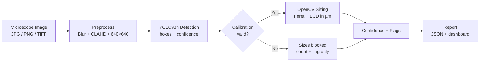

# Hydro Lens — Portable Microplastics Screening System

A React + Vite + Tailwind CSS frontend and FastAPI backend for **Hydro Lens**, an automated optical screening pipeline for microplastic particle detection, sizing, calibration, and sample confidence assessment.

---

## Quick Start

### 1. Backend Service (FastAPI)
The FastAPI service wraps the Python pipeline in `src/` without modifying any algorithm signatures.

```bash
# Install Python dependencies (FastAPI, uvicorn, python-multipart, pytest, etc.)
pip install fastapi "uvicorn[standard]" python-multipart pytest -r requirements.txt

# Run backend API server on port 8000
python -m uvicorn api.main:app --host 127.0.0.1 --port 8000 --reload
```

The API health check will be available at: [http://localhost:8000/api/health](http://localhost:8000/api/health)

### 2. Frontend Web Application (React + Vite + Tailwind CSS v4)
The frontend provides a clinical-lab Soft Pastel Blue Flat UI matching the Stitch design system.

```bash
cd frontend

# Install Node dependencies
npm install

# Start Vite development server on port 5173
npm run dev
```

Open your browser at: [http://localhost:5173](http://localhost:5173)

---

## 🧪 Running Unit Tests & Fallback Demo

### Python Backend Unit Tests
```bash
python -m pytest tests/test_backend.py
```

### Streamlit Fallback Demo (Legacy App)
`app.py` remains untouched as the live demo fallback path:
```bash
streamlit run app.py
```

---

## System at a Glance

| Component | Technology | Purpose |
|-----------|------------|---------|
| Detection | YOLOv8n (fine-tuned) | Bounding-box object detection |
| Sizing | OpenCV (Feret's diameter, ECD) | Physical size estimation |
| Preprocessing | Median blur + CLAHE | Denoising + contrast enhancement |
| UI | Streamlit | Image upload → results dashboard |
| Calibration | Stage micrometer + reference beads | Pixel-to-µm mapping |

### Pipeline at a Glance



---

## Key Results (Target)

- **Detection range:** 10 µm – 5 mm (validated via calibration)
- **Inference time:** < 2 sec/image on CPU (Raspberry Pi 4 / laptop)
- **Model size:** ~6 MB (YOLOv8n)
- **Confidence reporting:** Per-particle + aggregate sample confidence
- **Calibration requirement:** Mandatory before quantitative reporting

---

## Repository Structure
## 📐 Project Structure

```
Hydro-Lens/
├── api/
│   └── main.py                # FastAPI backend wrapping src/
├── frontend/                  # React + Vite + Tailwind v4 app
│   ├── src/
│   │   ├── api/
│   │   │   ├── client.ts      # Typed API fetch wrapper
│   │   │   └── types.ts       # Strict TypeScript interfaces
│   │   ├── components/        # GlassCard, MetricCard, StatusStrip, Dropzone, etc.
│   │   ├── hooks/             # useAnalysis, useCalibration
│   │   ├── pages/             # Analyze.tsx, Calibration.tsx, Diagnostics.tsx
│   │   └── index.css          # Glassmorphism & Soft Pastel Blue CSS variables
│   ├── package.json
│   └── vite.config.ts
├── src/                       # Python core pipeline (READ-ONLY)
│   ├── preprocess.py
│   ├── detect.py
│   ├── size.py
│   ├── calibrate.py
│   ├── confidence.py
│   └── utils.py
├── tests/
│   └── test_backend.py
├── app.py                     # Streamlit demo fallback (READ-ONLY)
└── config.yaml
```