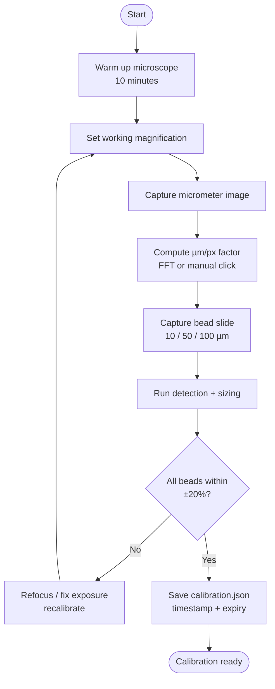

# Calibration Procedure — Hydro Lens

## Why Calibration Matters

**Without calibration, pixel measurements are meaningless.** Every quantitative claim (count, size, concentration) depends on a valid µm/pixel factor. The system **refuses to report concentrations** without a current calibration.

---

## Calibration Hardware

| Item | Specification | Purpose |
|------|---------------|---------|
| Stage micrometer | 1 mm scale, 10 µm divisions (NIST-traceable) | Primary µm/pixel calculation |
| Polymer reference beads | 10 µm, 50 µm, 100 µm ± 2% (e.g., Thermo Scientific) | Validation at multiple sizes |
| Calibration slide | Clean glass slide, same mounting medium as samples | Match optical path |

---

## Calibration Protocol



### Step 1: Setup
1. Power on microscope, allow 10 min warm-up for stable illumination
2. Set magnification to **exact working magnification** used for samples (e.g., 200×)
3. Record magnification, camera resolution, binning in calibration log
4. Place stage micrometer on stage, focus sharply on scale lines

### Step 2: Capture Calibration Image
1. Capture image of micrometer (save as PNG, no compression)
2. Ensure multiple scale divisions visible (≥ 5 divisions = 50 µm minimum)
3. Avoid saturated pixels — adjust exposure so lines are sharp, not bloomed

### Step 3: Compute µm/pixel
```python
# src/calibrate/compute_factor.py
import cv2
import numpy as np

def compute_um_per_pixel(image_path, known_spacing_um=10):
    """
    known_spacing_um: distance between adjacent lines on micrometer (µm)
    Returns: um_per_pixel (float)
    """
    img = cv2.imread(image_path, cv2.IMREAD_GRAYSCALE)
    # Detect lines via FFT or Hough transform
    # Measure pixel distance between N line pairs
    # Return mean(known_spacing_um * N_pairs / total_pixels)
```

**Automated method:** FFT-based line spacing detection (robust to focus drift).

**Manual fallback:** User clicks two lines N divisions apart → system computes factor.

### Step 4: Validate with Reference Beads
1. Replace micrometer with polymer bead slide (10/50/100 µm mix)
2. Capture image at same magnification
3. Run detection + sizing pipeline
4. Compare measured ECD to nominal:
   - **Pass:** |measured - nominal| / nominal ≤ 20% for all three sizes
   - **Warn:** 20–30% for any size (flag in calibration JSON)
   - **Fail:** > 30% for any size → recalibrate

### Step 5: Save Calibration Record
```json
{
  "version": "1.0",
  "timestamp": "2026-09-25T14:30:00Z",
  "microscope": "AmScope 200X USB",
  "camera": "1920x1080, binning=1",
  "magnification": "200x",
  "factor_um_per_px": 0.417,
  "validation": {
    "bead_10um": {"nominal": 10, "measured": 11.2, "error_pct": 12},
    "bead_50um": {"nominal": 50, "measured": 48.5, "error_pct": -3},
    "bead_100um": {"nominal": 100, "measured": 97.1, "error_pct": -2.9}
  },
  "valid": true,
  "expires": "2026-10-02T14:30:00Z"
}
```
Saved to: `data/calibration/calibration.json`

---

## Calibration Validity Rules

| Condition | Calibration Quality | System Behavior |
|-----------|---------------------|-----------------|
| Valid calibration (< 7 days, validation pass) | 1.0 | Full quantitative output |
| Calibration missing | 0.0 | **Block quantitative output**, show warning |
| Calibration stale (≥ 7 days) | 0.5 | Allow output with warning, flag all particles |
| Validation failed (bead error > 30%) | 0.0 | **Block quantitative output** |
| Magnification changed | 0.0 | **Block quantitative output** |

---

## Recalibration Triggers

- [ ] 7 days elapsed since last calibration
- [ ] Magnification changed
- [ ] Camera/microscope moved or refocused significantly
- [ ] Illumination changed (new bulb, different LED intensity)
- [ ] Temperature shift > 5°C (thermal focus drift)
- [ ] Validation beads show > 20% error on any size

---

## Concentration Calculation (Post-Calibration)

Only computed when calibration valid:

```
concentration (particles/L) = (total_count / imaged_area_mm2) × (sample_volume_ml / 1000) × dilution_factor
```

- `imaged_area_mm2` = (image_width_px × factor_um_per_px / 1000) × (image_height_px × factor_um_per_px / 1000)
- `sample_volume_ml`: volume filtered (user input)
- `dilution_factor`: if sample diluted before filtration (user input)

**System requires user to input sample_volume_ml and dilution_factor before showing concentration.**

---

## Calibration UI (Streamlit)

```
┌─ Calibration Status ────────────────────────────────┐
│ Status: ✅ VALID (expires 2026-10-02)                │
│ Factor: 0.417 µm/px | Mag: 200× | Camera: 1920×1080 │
│ Validation: 10µm +12% | 50µm -3% | 100µm -2.9%      │
├─────────────────────────────────────────────────────┤
│ [Recalibrate]  [View Log]  [Validate Now]           │
└─────────────────────────────────────────────────────┘
```

If invalid:
```
⚠️ CALIBRATION REQUIRED
No valid calibration found. Quantitative results (count, size, concentration)
are disabled until calibration is completed.
[Run Calibration Wizard]
```

---

## Calibration Log (Append-only)

| Date | Factor | Mag | Validation | Operator | Notes |
|------|--------|-----|------------|----------|-------|
| 2026-09-25 | 0.417 | 200× | Pass | Anshul | Initial |
| 2026-09-28 | 0.415 | 200× | Pass | Prithviraj | Weekly re-check |
| 2026-10-01 | 0.418 | 400× | Pass | Ishwari | Mag change |

---

## Edge Cases

| Scenario | Handling |
|----------|----------|
| User uploads image from different microscope | Reject or require new calibration |
| Zoom changed in software (digital zoom) | Treat as magnification change → recalibrate |
| Beads not available | Allow micrometer-only calibration, set quality=0.8, flag |
| Multiple magnifications in one session | Separate calibration per magnification, auto-select by EXIF/metadata |

---

## Quick Reference Card (Print for Field Use)

```
HYDRO LENS — CALIBRATION QUICK START

1. WARM UP: 10 min microscope ON
2. SET MAG: 200× (or your working mag)
3. MICROMETER: Place on stage, focus
4. CAPTURE: Save as calibration_micrometer.png
5. COMPUTE: Run "Calibrate" in app → auto factor
6. VALIDATE: Swap to bead slide, capture
7. CHECK: All 3 beads within ±20%?
   YES → Save → Ready
   NO  → Re-focus, repeat from step 3
8. LOG: App auto-saves with timestamp

RECALIBRATE IF: 7 days | mag change | focus drift | temp >5°C
```