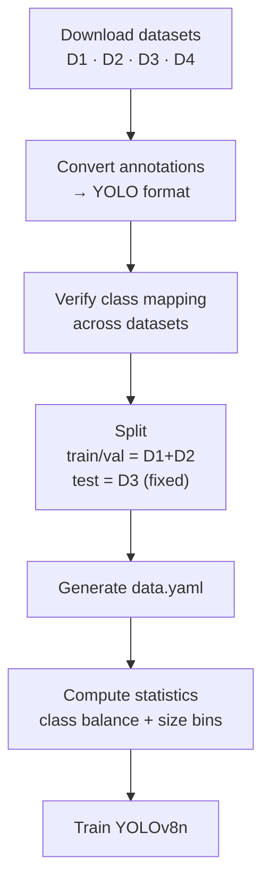

# Dataset Documentation — Hydro Lens

## Datasets Used

| # | Dataset | Source | Role | Images | Annotations | License |
|---|---------|--------|------|--------|-------------|---------|
| 1 | **Microplastic Fluorescence** | [sombsuk/dataset_microplastic](https://github.com/sombsuk/dataset_microplastic) | Training | ~1,200 | YOLO format (class + bbox) | CC-BY-4.0 |
| 2 | **Microplastics in Sewage** | [anonymous.4open.science/r/Microplastics-inSewage-1BEF](https://anonymous.4open.science/r/Microplastics-inSewage-1BEF/README.md) | Training | ~800 | YOLO format | CC-BY-4.0 |
| 3 | **HMPD** | [beppe2hd/HMPD](https://github.com/beppe2hd/HMPD) | **Independent evaluation only** | ~2,500 | COCO/YOLO | CC-BY-4.0 |
| 4 | **WWTP Fragments** (optional) | [andreusv/MicroplasticFragments-WWTP-Dataset](https://huggingface.co/datasets/andreusv/MicroplasticFragments-WWTP-Dataset) | Extra training | ~3,000 | YOLO format | CC-BY-4.0 |

---

## Class Definitions

| Class ID | Name | Description | Datasets |
|----------|------|-------------|----------|
| 0 | `fragment` | Irregular angular particles | 1, 2, 3, 4 |
| 1 | `fiber` | Elongated, aspect ratio > 3:1 | 1, 2, 3 |
| 2 | `film` | Thin, flat, sheet-like | 1, 3 |
| 3 | `foam` | Porous, cellular structure | 1, 3 |
| 4 | `pellet` | Spherical/ovoid, pre-production | 1, 3 |

> **Note:** Dataset 1 & 2 primarily contain fragments and fibers. Films, foams, pellets are sparser — model performance on these classes will be lower and flagged in confidence.

---

## Train / Val / Test Split

```
Training:     Dataset 1 (80%) + Dataset 2 (80%)  →  ~1,600 images
Validation:   Dataset 1 (10%) + Dataset 2 (10%)  →  ~200 images
Test:         Dataset 3 (100%)                   →  ~2,500 images (unseen domain)
Optional:     Dataset 4 (80/10/10) mixed in      →  +2,400 train / +300 val / +300 test
```

**Critical:** Dataset 3 (HMPD) is **never used in training**. It serves as the sole independent evaluation benchmark, simulating real-world domain shift (different microscopes, lighting, sample prep).

---

## Data Preparation Pipeline

```python
# src/data/prepare.py
1. Download all datasets
2. Convert annotations to unified YOLO format (class_id x_center y_center width height)
3. Verify class mapping consistency across datasets
4. Split: train/val from D1+D2, test = D3 (fixed)
5. Generate data.yaml for YOLO training
6. Compute dataset statistics (class balance, size distribution)
```



---

## Dataset Statistics (Target)

| Metric | Dataset 1 | Dataset 2 | Dataset 3 (Test) | Dataset 4 |
|--------|-----------|-----------|------------------|-----------|
| Images | 1,200 | 800 | 2,500 | 3,000 |
| Avg objects/img | 8.2 | 12.5 | 15.3 | 6.8 |
| Class balance (frag:fiber:film:foam:pellet) | 65:25:5:3:2 | 70:20:5:3:2 | 55:30:5:5:5 | 80:10:5:3:2 |
| Size range (µm) | 10–500 | 20–1000 | 10–5000 | 15–800 |
| Imaging mode | Fluorescence | Bright-field | Mixed | Bright-field |

---

## Licensing & Attribution

All datasets: **CC-BY-4.0** — requires attribution.

**Attribution block for model card / paper:**
> This work uses the following datasets:
> - Microplastic Fluorescence Dataset (Sombsuk et al., CC-BY-4.0)
> - Microplastics in Sewage Dataset (Anonymous, CC-BY-4.0)
> - HMPD Dataset (Beppe2hd, CC-BY-4.0)
> - Microplastic Fragments WWTP Dataset (Andreusv, CC-BY-4.0)

---

## Known Limitations

| Issue | Impact | Mitigation |
|-------|--------|------------|
| Class imbalance (fragments dominant) | Lower recall on fiber/film/foam/pellet | Weighted loss, oversampling minority classes |
| Domain gap: fluorescence vs bright-field | Model may overfit to fluorescence artifacts | Mixed-batch training, test on D3 (bright-field) |
| Annotation quality varies | Noisy labels → label noise in training | Manual review of 10% samples, label correction |
| Size range gap (D1/D2 max ~1mm, D3 up to 5mm) | Large particles underrepresented in training | Data augmentation: copy-paste large particles from D3 into train (but D3 is test-only — use D4 or synthetic) |
| No polymer-type labels | Cannot train polymer classifier | Explicitly out of scope for v1 |

---

## Versioning

| Version | Date | Changes |
|---------|------|---------|
| 1.0 | 2026-09-25 | Initial split: D1+D2 train, D3 test, D4 optional |
| 1.1 | TBD | Add synthetic large-particle augmentation |

---

## Download & Setup

```bash
# Run once to fetch and prepare all data
python src/data/prepare.py --download --output data/processed
```

Outputs:
- `data/processed/train/images/`, `labels/`
- `data/processed/val/images/`, `labels/`
- `data/processed/test/images/`, `labels/` (Dataset 3 only)
- `data/processed/data.yaml` — YOLO config
---

## Post-Hackathon 5-Class Retrain — Roboflow Picks (Decided 2026-09-27)

Five Roboflow Universe datasets for the 5-class morphology model (`fragment`/`fiber`/`film`/`foam`/`pellet`). Selection rule: bounding-box or polygon annotations, ≥3 morphology classes, permissive license preferred.

| # | Dataset | Owner | Images | Classes | Task | License |
|---|---------|-------|--------|---------|------|---------|
| R1 | [newmp](https://universe.roboflow.com/search?q=newmp) | University of Alabama | 5,000 | fiber, film, foam, fragment, pellet (**all 5**) | Object detection | *verify at download* |
| R2 | [all plastic](https://universe.roboflow.com/search?q=all+plastic) | University | 7,050 | dirt, fiber, fragment, pellet | Object detection | *verify at download* |
| R3 | [mp-segmentation-jp](https://universe.roboflow.com/search?q=mp-segmentation-jp) | Johann Catalla | 1,540 | fiber, film, foam, fragment, pellet, sheet | Instance segmentation → boxes | *verify at download* |
| R4 | [microplastic-final](https://universe.roboflow.com/project-aunby/microplastic-final-kpdl3) | Project | 398 | fiber, film, fragment, pellet | Instance segmentation → boxes | CC BY 4.0 |
| R5 | [Microplastic Annotations](https://universe.roboflow.com/microplastic-annotations/microplastic-annotations-n1y9l) | Microplastic Annotations | 226 | fiber, film, foam, fragment, pellet (typos: `filber`, `Fragmnet`) | Object detection | CC BY 4.0 |

**Total: ~14,200 images.**

### Class merge map (apply in `src/data/prepare.py`)

```
dirt, sheet              → drop (out of scope)
filber, Fiber            → fiber
Fragmnet, Fragment       → fragment
Film, Foam, Pellet       → film, foam, pellet
pallet                   → pellet
```

### Prep checklist

- [ ] Export every set as **YOLOv8 bbox** (polygon sets R3/R4: Roboflow converts on export)
- [ ] Apply merge map above → unified 5-class `data.yaml`
- [ ] Dedup by image hash — R4/R5 may derive from the same source images
- [ ] Hold out HMPD (D3) as the untouched test set, same as v1
- [ ] Update `config.yaml` class names + order to match new `data.yaml` (ML_Log Decision 1)

### Rejected (and why)

| Dataset | Images | Why not |
|---------|--------|---------|
| [microplastic_detection](https://universe.roboflow.com/yolov8-eruri/microplastic_detection) (yolov8) | 4,607 | Single class `Microplastic` — no morphology labels |
| [MicroPlastics](https://universe.roboflow.com/iam/microplastics-m7mf5) (IAM) / microplastic-nuga5 (Project) | 400 | **BY-NC-SA 4.0** — non-commercial |
| [Microplastics Detection](https://universe.roboflow.com/hina-tmh4j/microplastics-detection-bfhbf) (Hina) | 637 | Backup only — 11 typo'd classes, same cleanup cost as R5 |
| Plastic (Eric Smallwood) | 730 | Backup only — 3 classes (no film/foam) |

> Roboflow downloads need a free account + API key: `pip install roboflow` → `Roboflow(api_key=...).workspace(...).project(...).download("yolov8")`.
