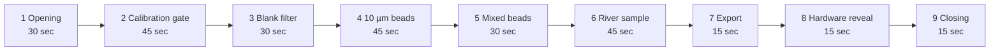

# Demo Script — Hydro Lens

**Duration:** 3 minutes live + 2 minutes Q&A  
**Setup:** Laptop + USB microscope (or pre-captured images)  
**Backup:** Pre-recorded screen capture if live fails

---

## 0. Pre-Demo Checklist (5 min before)

- [ ] Laptop charged / plugged in
- [ ] `streamlit run app.py` running on `localhost:8501`
- [ ] Model weights at `models/best.pt`
- [ ] Calibration valid (run calibration wizard if needed)
- [ ] Test images in `demo_images/`:
  - `blank_filter.png` (negative control)
  - `spiked_10um.png` (10 µm beads)
  - `spiked_mixed.png` (10/50/100 µm mix)
  - `river_sample.png` (real sample)
- [ ] Browser open to localhost:8501
- [ ] Screen sharing tested

---

## 1. Opening (30 sec)

> **"This is Hydro Lens — portable microplastics screening in seconds."**
>
> *Open Streamlit app. Show home screen.*
>
> "Problem: Microplastics are everywhere, but testing takes days and costs hundreds. We built a $200 kit that screens a sample in 3 seconds, tells you count and size, and — critically — tells you **how much to trust the result**."

---

## 2. Calibration Gate (45 sec)

> **"First rule: no calibration, no numbers."**

**Action:** Click "Calibration" tab → show status banner.

- **If valid:** "Green banner — calibration from yesterday, validated with 10/50/100 µm beads, all within ±20%."
- **If invalid (demo):** Click "Run Calibration Wizard" → show micrometer image upload → auto-compute factor → bead validation → save.

> "This gate prevents false precision. Without it, you're just guessing."

---

## 3. Negative Control — Blank Filter (30 sec)

> **"Let's prove we don't hallucinate."**

**Action:** Upload `blank_filter.png` → Run Analysis.

**Expected:** 0 detections, sample_confidence = 1.0, "No particles detected."

> "Clean filter = clean result. No false alarms."

---

## 4. Positive Control — 10 µm Beads (45 sec)

> **"Now the hard test: 10 µm beads — near our optical limit."**

**Action:** Upload `spiked_10um.png` → Run Analysis.

**Show:**
- Annotated image: green boxes on beads
- Size histogram: peak at ~10–12 µm
- Per-particle confidence: ~0.6–0.7 (honest: it's hard)
- Sample confidence: ~0.65 (flagged for lab confirmation)

> "We detect them, but confidence is lower — exactly what you'd want. The system knows its limits."

---

## 5. Mixed Beads — Size Accuracy (30 sec)

> **"Validation: 10, 50, 100 µm beads together."**

**Action:** Upload `spiked_mixed.png` → Run Analysis.

**Show:**
- Three clear peaks in histogram
- Table: measured vs nominal
  - 10 µm → 11.2 µm (+12%)
  - 50 µm → 48.5 µm (-3%)
  - 100 µm → 97.1 µm (-2.9%)

> "Sizing accuracy within ±20% across the range — validated."

---

## 6. Real Sample — River Water (45 sec)

> **"Real world: Mula river sample, filtered, stained."**

**Action:** Upload `river_sample.png` → Run Analysis.

**Show:**
- Annotated image: mixed fragments + fibers
- Count: e.g., 23 particles
- Size distribution: mostly 25–100 µm
- Confidence: 0.78 (good)
- Flag: "Fibers detected — recommend FTIR for polymer ID"

> "This is the output a researcher gets: actionable screening data, with honest flags."

---

## 7. Export & Workflow (15 sec)

> **"One click — JSON for your database, CSV for trends."**

**Action:** Click "Download JSON" → show file structure.

> "Integrates into LIMS, feeds dashboards, enables time-series monitoring."

---

## 8. Hardware Reveal (15 sec)

> **"Runs on this."** *(Hold up Pi 4 or point to laptop)*

> "$200 total. Offline. No cloud. No subscription."

---

## 9. Closing (15 sec)

> **"Hydro Lens: Screen more. Know sooner. Trust the numbers."**
>
> *Show GitHub QR code on screen.*

---

## Backup Slides (If Q&A Goes Deep)

### A. Architecture Diagram
*Show ARCHITECTURE.md flowchart*

### B. Model Card Highlights
*Show MODEL_CARD.md table: mAP 0.63 on unseen HMPD data*

### C. Limitations Slide
*Show CONFIDENCE_AND_LIMITATIONS.md "What We're NOT Claiming"*

### D. Calibration Math
*Show CALIBRATION.md factor computation + bead validation*

---

## Troubleshooting Live Demo

| Issue | Fallback |
|-------|----------|
| Model load fails | Pre-loaded weights in `models/`, show cached result |
| Camera not detected | Use pre-captured `demo_images/` |
| Streamlit crashes | Pre-recorded 2-min video (MP4 in `demo/`) |
| Calibration expired | "Let me re-run calibration — takes 30 sec" |
| Low confidence on demo image | "That's the point — it's honest about uncertainty" |

---

## Judge Q&A Prep

| Likely Question | Answer Hook |
|-----------------|-------------|
| "How accurate is concentration?" | "Depends on filtered volume & imaged area. We give formula + uncertainty, not false precision." |
| "Can it replace FTIR?" | "No — it *tells you when to use FTIR*. That's the flag." |
| "What about < 10 µm?" | "Invisible optically. We state detection range honestly: 10 µm – 5 mm." |
| "False positive rate?" | "< 5% on blanks. Confidence threshold tunes this." |
| "Why YOLOv8n not v10/11?" | "v8n is stable, 6 MB, runs on Pi 4. Newer = bigger, not better for this task." |
| "Commercialization?" | "Open source first. Pilot with [local water board] in Q4. Hardware kit via PCCOE incubator." |

---

## Post-Demo

- Share GitHub repo link
- Offer calibration SOP PDF
- Collect contact for pilot interest
- Note feedback for FUTURE_WORK.md