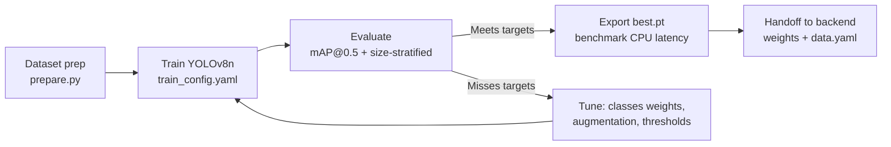

# AI/ML Development Guide — Hydro Lens

> For: ML Engineer  
> Scope: Dataset preparation, YOLOv8n fine-tuning, evaluation, export



---

## 1. Environment Setup

```bash
# Dedicated env for training (separate from backend)
conda create -n hydro-lens-train python=3.10 -y
conda activate hydro-lens-train

# GPU-enabled PyTorch (adjust for your CUDA)
pip install torch torchvision --index-url https://download.pytorch.org/whl/cu121

# Ultralytics + dependencies
pip install ultralytics==8.2.0 opencv-python==4.8.1 numpy==1.24.3 pyyaml==6.0.1
pip install scikit-learn==1.3.0  # for confidence calibration
pip install wandb  # optional: experiment tracking
```

---

## 2. Dataset Preparation (`src/data/prepare.py`)

### Directory Structure After Prep
```
data/processed/
├── train/
│   ├── images/  (.jpg)
│   └── labels/  (.txt)  # YOLO format: class_id x_c y_c w h (normalized)
├── val/
│   ├── images/
│   └── labels/
├── test/          # HMPD only (never used in training)
│   ├── images/
│   └── labels/
└── data.yaml      # YOLO config
```

### `data.yaml`
```yaml
path: data/processed
train: train/images
val: val/images
test: test/images

nc: 5
names:
  0: fragment
  1: fiber
  2: film
  3: foam
  4: pellet
```

### Preparation Steps
```python
# src/data/prepare.py
def prepare_datasets():
    # 1. Download Dataset 1 (fluorescence) + Dataset 2 (sewage)
    # 2. Convert annotations to YOLO format (unify class mapping)
    # 3. Split each 80/10/10 -> combine train, combine val
    # 4. Download Dataset 3 (HMPD) -> use 100% as test (NO TRAIN LEAKAGE)
    # 5. Optional: Dataset 4 -> add to train/val if annotations compatible
    # 6. Verify: no duplicate filenames, class balance stats
    # 7. Write data.yaml
```

### Class Mapping (Critical)
| Source Class | Target ID | Notes |
|--------------|-----------|-------|
| fragment | 0 | Primary class |
| fiber / filament | 1 | Aspect ratio > 3 |
| film / sheet | 2 | Thin, flat |
| foam / sponge | 3 | Porous |
| pellet / sphere | 4 | Round |
| unknown / other | -1 | **Drop** — don't train on ambiguous |

---

## 3. Training Configuration

### `train_config.yaml`
```yaml
model: yolov8n.pt  # Start from COCO pretrained
data: data/processed/data.yaml
epochs: 100
patience: 20
batch: 16
imgsz: 640
device: 0  # GPU id
workers: 8

# Optimization
optimizer: SGD
lr0: 0.01
lrf: 0.01
momentum: 0.937
weight_decay: 0.0005
warmup_epochs: 3
warmup_momentum: 0.8
warmup_bias_lr: 0.1

# Loss weights (address class imbalance)
cls: 1.0  # classification loss gain
box: 7.5  # box regression loss gain
dfl: 1.5  # DFL loss gain

# Augmentation (keep realistic for microscopy)
hsv_h: 0.015
hsv_s: 0.7
hsv_v: 0.4
degrees: 10.0
translate: 0.1
scale: 0.5
shear: 2.0
perspective: 0.0
flipud: 0.0
fliplr: 0.5
mosaic: 1.0
mixup: 0.1
copy_paste: 0.1

# Class weights (inverse frequency from train set)
# Compute after prepare.py runs:
# class_weights: [0.8, 2.1, 4.5, 5.2, 6.0]  # example
```

### Train Command
```bash
# Single GPU
yolo detect train \
  model=yolov8n.pt \
  data=data/processed/data.yaml \
  epochs=100 \
  imgsz=640 \
  batch=16 \
  device=0 \
  project=runs/train \
  name=hydro_lens_v1 \
  cfg=train_config.yaml

# Resume
yolo detect train resume runs/train/hydro_lens_v1/weights/last.pt
```

---

## 4. Evaluation Protocol

### Primary Metric: mAP@0.5 on HMPD Test Set (Dataset 3)
```bash
yolo detect val \
  model=runs/train/hydro_lens_v1/weights/best.pt \
  data=data/processed/data.yaml \
  split=test \
  imgsz=640 \
  batch=16
```

### Required Outputs
| Metric | Target | Where to Log |
|--------|--------|--------------|
| mAP@0.5 (overall) | > 0.60 | W&B / CSV |
| mAP@0.5:0.95 | > 0.35 | W&B / CSV |
| Per-class Recall (fragments 25-500µm) | > 0.70 | Custom script |
| Per-class Precision | > 0.65 | Custom script |
| Inference time (CPU) | < 1.5s | Benchmark script |

### Size-Stratified Evaluation (Critical)
```python
# src/eval/size_stratified.py
def evaluate_by_size(model_path, test_images, test_labels, size_bins):
    """
    Returns dict: {size_bin: {precision, recall, f1, count}}
    Size bins: 10-25, 25-50, 50-100, 100-500, 500-5000 µm
    Requires ground truth size in µm (from HMPD annotations)
    """
```

### Confidence Calibration (Platt Scaling)
```python
# src/eval/calibrate_confidence.py
from sklearn.calibration import CalibratedClassifierCV
from sklearn.isotonic import IsotonicRegression

def calibrate_confidence(val_predictions, val_ground_truth):
    """
    val_predictions: list of (conf, iou) per detection
    val_ground_truth: 1 if IoU > 0.5 else 0
    Fit: IsotonicRegression or CalibratedClassifierCV
    Save: calibrator.pkl -> load in backend for production
    """
```

---

## 5. Model Export & Optimization

### Export Formats
```bash
# ONNX (for ONNX Runtime, TensorRT)
yolo export model=runs/train/hydro_lens_v1/weights/best.pt format=onnx imgsz=640

# TorchScript (for C++ deployment)
yolo export model=best.pt format=torchscript

# CoreML (for iOS/macOS)
yolo export model=best.pt format=coreml

# NCNN (for mobile/embedded)
yolo export model=best.pt format=ncnn
```

### Quantization (Optional, for Pi/Jetson)
```python
# Post-training quantization (ONNX Runtime)
import onnxruntime.quantization as quant
quant.quantize_dynamic(
    model_input="best.onnx",
    model_output="best_int8.onnx",
    weight_type=quant.QuantType.QInt8
)
```

---

## 6. Experiment Tracking (W&B)

```python
# In train script or via ultralytics callbacks
import wandb

wandb.init(
    project="hydro-lens",
    name="yolov8n_finetune_v1",
    config={
        "model": "yolov8n",
        "datasets": ["D1_fluorescence", "D2_sewage"],
        "test_set": "HMPD",
        "epochs": 100,
        "imgsz": 640,
        "batch": 16,
    }
)
# Ultralytics auto-logs to W&B if installed
```

---

## 7. Reproducibility Checklist

- [ ] Random seeds set: `torch.manual_seed(42)`, `numpy.random.seed(42)`
- [ ] Dataset splits fixed (save split indices JSON)
- [ ] Training config versioned (`train_config.yaml` in git)
- [ ] Best/last weights saved: `best.pt`, `last.pt`
- [ ] Evaluation on test set **only after** training complete
- [ ] Confidence calibrator saved (`calibrator.pkl`)
- [ ] Model card updated with final metrics (`MODEL_CARD.md`)

---

## 8. Common Issues & Fixes

| Issue | Diagnosis | Fix |
|-------|-----------|-----|
| mAP stagnates at ~0.3 | Learning rate too high | Reduce `lr0` to 0.005, increase warmup |
| High FP on blanks | Confidence threshold too low | Raise `conf_threshold` to 0.35 for val |
| Fiber recall < 0.4 | Class imbalance | Increase `cls` gain, add `copy_paste` for fibers |
| Overfit (train mAP >> val) | Too many epochs / strong aug | Add dropout, reduce mosaic/mixup, early stop |
| Nan loss | Bad annotations | Filter zero-area boxes, check label format |
| Slow inference | FP32 on CPU | Export ONNX + ONNX Runtime, or FP16 |

---

## 9. Handoff to Backend

### Deliverables
| File | Location | Description |
|------|----------|-------------|
| `best.pt` | `models/best.pt` | Final weights (FP32) |
| `best.onnx` | `models/best.onnx` | Optional: ONNX for faster CPU |
| `calibrator.pkl` | `models/calibrator.pkl` | Confidence calibrator |
| `data.yaml` | `data/processed/data.yaml` | Class names + paths |
| `train_config.yaml` | `train_config.yaml` | Exact training config |
| `metrics.csv` | `runs/train/.../metrics.csv` | Training curves |

### Backend Integration Points
```python
# Backend expects these class names in order:
CLASS_NAMES = ["fragment", "fiber", "film", "foam", "pellet"]

# Backend uses these config values (must match):
CONF_THRESHOLD = 0.25
IOU_THRESHOLD = 0.45
MAX_DET = 300
INPUT_SIZE = 640
```

---

## 10. Future Model Improvements

| Idea | Effort | Expected Gain |
|------|--------|---------------|
| RT-DETR (real-time DETR) | Medium | +3-5% mAP, similar speed |
| YOLOv8s/m/l (larger) | Low (retrain) | +5-8% mAP, 2-4× slower |
| Semi-supervised (pseudo-label unlabeled) | High | +2-4% if good unlabeled data |
| Test-time augmentation (TTA) | Low | +1-2% mAP, 4× slower |
| Knowledge distillation to YOLOv8n | Medium | Keep speed, gain ~2% mAP |

---

## 11. Quick Commands Reference

```bash
# Train
yolo detect train model=yolov8n.pt data=data.yaml epochs=100 imgsz=640 batch=16 device=0

# Validate on test
yolo detect val model=best.pt data=data.yaml split=test

# Predict on folder (for qualitative check)
yolo detect predict model=best.pt source=data/processed/test/images save_txt save_conf

# Export
yolo export model=best.pt format=onnx imgsz=640

# Benchmark speed
yolo benchmark model=best.pt format=onnx device=cpu
```

---

## 12. Directory Layout for ML Work

```
hydro-lens/
├── data/
│   ├── raw/              # Downloaded datasets (gitignored)
│   └── processed/        # Prepared YOLO format (gitignored, large)
├── runs/
│   └── train/            # Training outputs (gitignored)
├── models/
│   ├── best.pt           # Committed (or LFS)
│   ├── best.onnx
│   └── calibrator.pkl
├── src/
│   ├── data/
│   │   ├── prepare.py
│   │   └── download.py
│   ├── eval/
│   │   ├── size_stratified.py
│   │   └── calibrate_confidence.py
│   └── train.py          # Optional: scripted training
├── train_config.yaml
└── requirements-train.txt
```

---

*ML owns: data prep, training, evaluation, export, model artifacts.*  
*Backend owns: inference pipeline, calibration, confidence scoring, UI.*  
*Contract: `best.pt` + `CLASS_NAMES` + `config.yaml` values.*