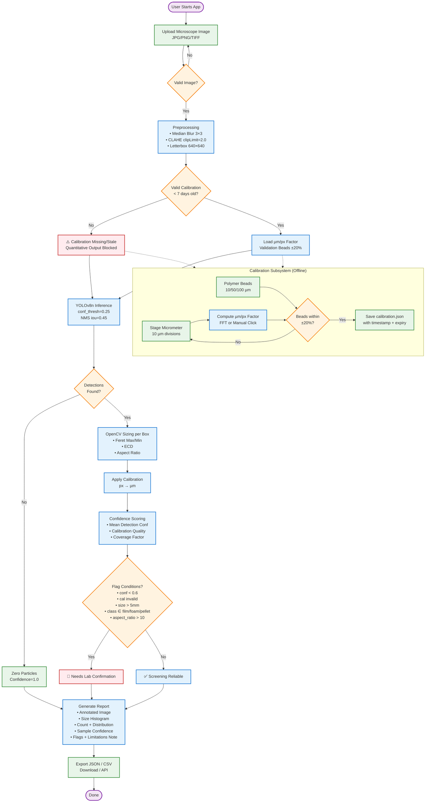
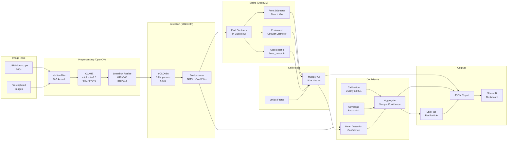
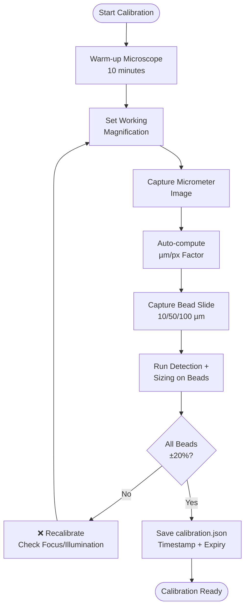
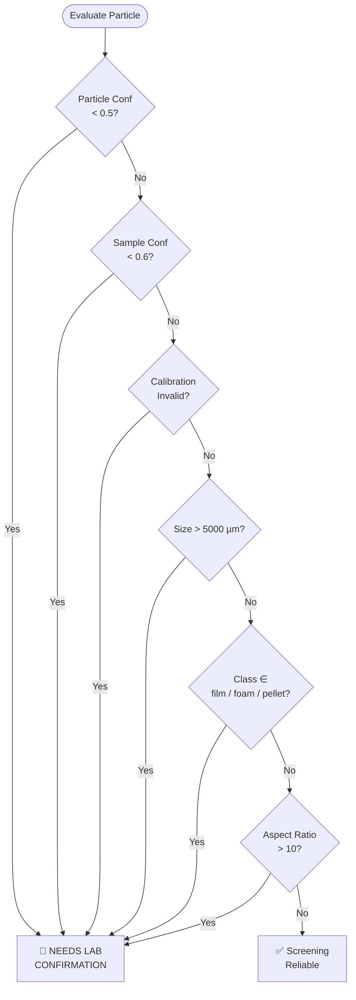
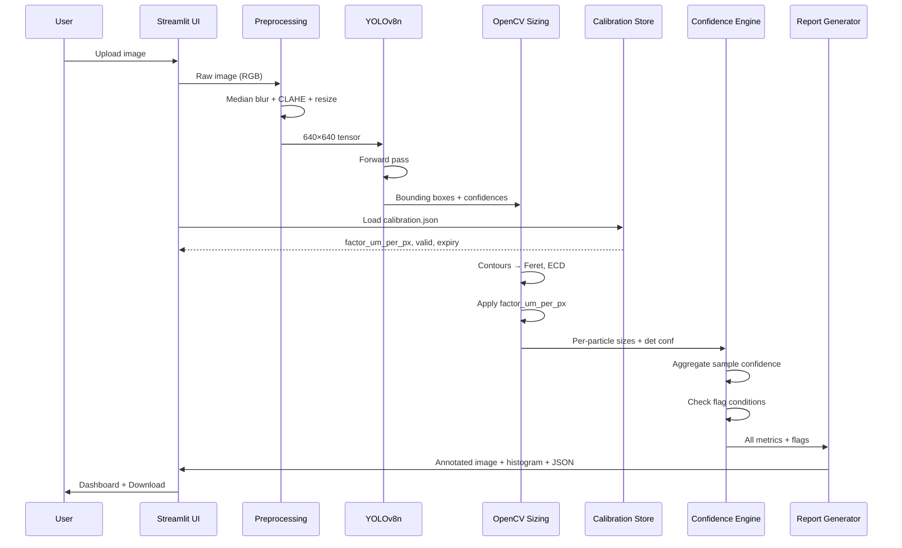
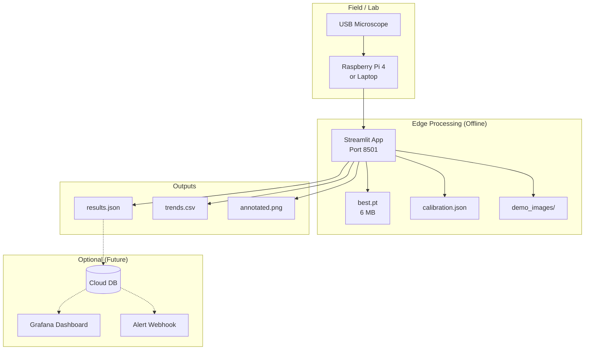

# System Flowchart — Hydro Lens

---

## Detailed Pipeline Flow

---

## Calibration Flow (Standalone)

---

## Decision Logic: "Needs Lab Confirmation"

---

## Data Flow: Image → JSON

---

## Deployment Topology

---

## Mermaid Rendering Notes

- Paste into any Markdown viewer with Mermaid support (GitHub, GitLab, Notion, Obsidian, VS Code with extension)
- For live demo: `markmap` or `mermaid-cli` can render to SVG/PNG
- Colors chosen for accessibility (colorblind-safe palette)

---

*Generated for HackMatrix 5.0 — Team Nishtha*