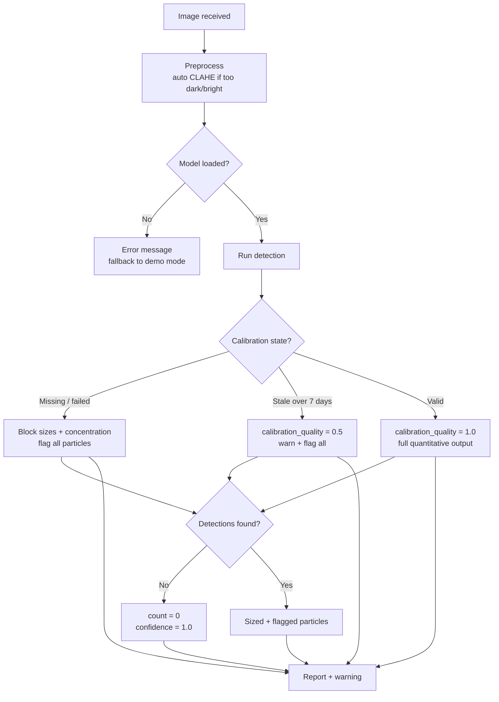

# System Specification — Hydro Lens

## 1. Purpose

Portable, affordable optical screening system for microplastics in water. Detects candidate particles, estimates count and size distribution, reports confidence, flags lab confirmation needs. Polymer identification is **explicitly optional**.

---

## 2. Scope

### In Scope (v1.0)
- [x] Particle detection from microscope images (bright-field & fluorescence)
- [x] Count estimation per sample
- [x] Size distribution (Feret's diameter, ECD) in µm
- [x] Per-particle and aggregate confidence scores
- [x] Mandatory calibration gate before quantitative output
- [x] "Needs lab confirmation" flag per result
- [x] Streamlit demo UI (upload image → see results)
- [x] Runs on laptop CPU / Raspberry Pi 4

### Out of Scope (v1.0)
- [ ] Polymer-type identification (FTIR/Raman correlation)
- [ ] Automated sample prep (filtration, staining)
- [ ] Regulatory compliance certification (ISO 24187, etc.)
- [ ] Real-time video stream processing
- [ ] Cloud deployment / multi-user backend

---

## 3. Functional Requirements

| ID | Requirement | Priority | Verification |
|----|-------------|----------|--------------|
| FR-01 | Accept RGB image (JPG/PNG/TIFF) from microscope or file upload | Must | Unit test |
| FR-02 | Preprocess: median blur (3×3) + CLAHE (clipLimit=2.0) | Must | Visual inspection |
| FR-03 | Detect particles with YOLOv8n, output bounding boxes + confidence | Must | mAP@0.5 on Dataset 3 |
| FR-04 | Compute Feret's diameter (max/min) and ECD per particle | Must | Compare to ground truth on calibration beads |
| FR-05 | Apply calibration factor (µm/pixel) from stored calibration | Must | Calibration test |
| FR-06 | Report particle count per size bin (10-25, 25-50, 50-100, 100+ µm) | Must | Integration test |
| FR-07 | Report per-particle detection confidence (0–1) | Must | Unit test |
| FR-08 | Compute sample confidence = mean(det_conf) × cal_quality × coverage | Must | Integration test |
| FR-09 | Flag "needs_lab_confirmation" if: confidence < 0.6 OR calibration invalid OR size > 5mm OR class in {film,foam,pellet} | Must | Integration test |
| FR-10 | Block quantitative output (count, size dist) if calibration missing/stale | Must | Integration test |
| FR-11 | Export results as JSON + human-readable dashboard | Must | Manual demo |

---

## 4. Non-Functional Requirements

| ID | Requirement | Target |
|----|-------------|--------|
| NFR-01 | Inference latency (CPU, 640×640) | < 3 sec/image |
| NFR-02 | Model size | < 10 MB |
| NFR-03 | Detection range | 10 µm – 5 mm (validated via calibration) |
| NFR-04 | Calibration validity period | 7 days (configurable) |
| NFR-05 | Minimum image coverage for valid quantitation | 1 mm² effective area |
| NFR-06 | False positive rate (on blank filter) | < 5% |
| NFR-07 | Recall on Dataset 3 (fragments 10–500 µm) | > 70% |
| NFR-08 | Power consumption (Pi 4) | < 10 W |

---

## 5. Hardware Requirements

| Component | Minimum | Recommended |
|-----------|---------|-------------|
| Compute | Raspberry Pi 4 (4 GB) / Laptop i5 | Laptop i7 / Jetson Nano |
| Camera | USB microscope 100× | USB microscope 200–500× + ring light |
| Storage | 8 GB SD / 16 GB SSD | 32 GB |
| RAM | 4 GB | 8 GB |
| OS | Ubuntu 22.04 / Raspberry Pi OS | Same |

---

## 6. Software Stack

| Layer | Technology | Version |
|-------|------------|---------|
| Language | Python | 3.10+ |
| ML Framework | Ultralytics YOLOv8 | 8.2+ |
| CV Library | OpenCV | 4.8+ |
| UI | Streamlit | 1.30+ |
| Numerical | NumPy | 1.24+ |
| Config | PyYAML | 6.0+ |

---

## 7. Detection Range & Validation

| Size Range | Status | Validation Method |
|------------|--------|-------------------|
| < 10 µm | **Not detected** | Below optical resolution at 100× |
| 10–25 µm | **Detected** (low confidence) | Calibration beads (10, 15, 20 µm) |
| 25–100 µm | **Detected** (high confidence) | Calibration beads + Dataset 3 |
| 100–500 µm | **Detected** (high confidence) | Dataset 3 |
| 500 µm – 5 mm | **Detected** (medium confidence) | Dataset 3 large particles |
| > 5 mm | **Flagged** (lab confirm) | Manual review |

---

## 8. Calibration Protocol (Summary)

See [CALIBRATION.md](CALIBRATION.md) for full procedure.

1. Place stage micrometer (known spacing) on stage
2. Capture image at working magnification
3. Compute µm/pixel from line pairs
4. Validate with NIST-traceable polymer beads (10, 50, 100 µm)
5. Save calibration JSON with timestamp
6. System refuses quantitative output without valid calibration

---

## 9. Confidence Scoring

See [CONFIDENCE_AND_LIMITATIONS.md](CONFIDENCE_AND_LIMITATIONS.md).

```
sample_confidence = mean(detection_confidences) × calibration_quality × coverage_factor
```

- `calibration_quality`: 1.0 (valid), 0.5 (missing/stale)
- `coverage_factor`: min(1.0, imaged_area_mm2 / 1.0)
- Flag lab confirmation if sample_confidence < 0.6

---

## 10. Output Format

### JSON (Machine-readable)
```json
{
  "schema_version": "1.0",
  "sample_id": "string",
  "timestamp": "ISO8601",
  "calibration": {"factor_um_per_px": float, "valid": bool, "date": "ISO8601"},
  "image_meta": {"width_px": int, "height_px": int, "magnification": "string"},
  "detections": [
    {
      "id": int,
      "class": "fragment|fiber|film|foam|pellet",
      "confidence": float,
      "bbox_px": [x, y, w, h],
      "size_um": {"feret_max": float, "feret_min": float, "ecd": float},
      "needs_lab_confirmation": bool
    }
  ],
  "summary": {
    "total_count": int,
    "size_distribution_um": {"10-25": int, "25-50": int, "50-100": int, "100+": int},
    "sample_confidence": float,
    "flag_lab_confirmation": bool
  }
}
```

### Human Dashboard (Streamlit)
- Annotated image with bounding boxes + size labels
- Histogram: size distribution
- Table: per-particle details
- Confidence gauge + calibration status banner
- "Download JSON" button

---

## 11. Error Handling



| Error Condition | Behavior |
|-----------------|----------|
| No calibration found | Show warning, allow detection only (no sizes), flag all particles |
| Calibration stale (>7 days) | Show warning, proceed with 0.5 calibration_quality |
| Image too dark/bright | Auto-adjust via CLAHE, log warning |
| No detections | Report count=0, confidence=1.0 (true negative) |
| Model load failure | Clear error message, fallback to demo mode |
| OOM on Pi | Batch size 1, log warning |

---

## 12. Security & Privacy

- No network calls in core pipeline (offline-first)
- Images processed locally, never uploaded
- No PII in water sample images
- Model weights stored locally

---

## 13. Acceptance Criteria for Hackathon Demo

1. **Live demo:** Upload image → see annotated results in < 3 sec
2. **Calibration gate:** Show warning when calibration missing, hide counts
3. **Confidence flag:** Low-confidence particles highlighted in red
4. **Size accuracy:** 10 µm beads measured within ±20% (10 µm = hardest case)
5. **Dataset 3 eval:** mAP@0.5 > 0.5 on fragments 25–500 µm
6. **Runs on Pi 4:** Full pipeline under 3 sec/image

---

## 14. Version History

| Version | Date | Author | Changes |
|---------|------|--------|---------|
| 1.0 | 2026-09-25 | Team Nishtha | Initial specification for HackMatrix 5.0 |