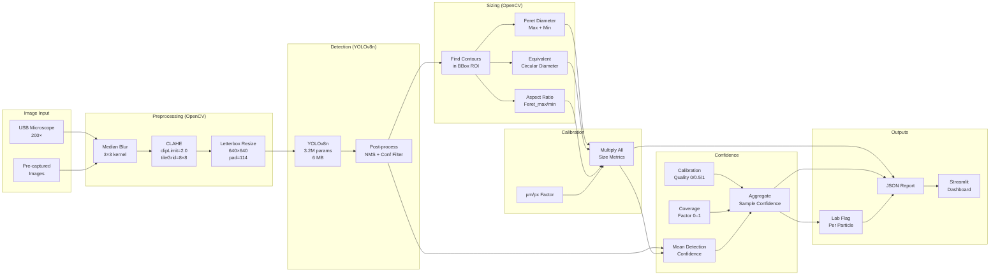
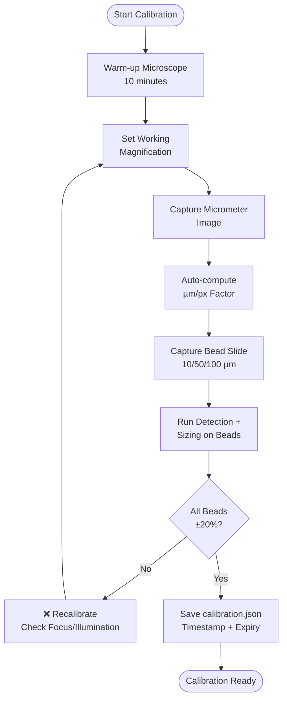
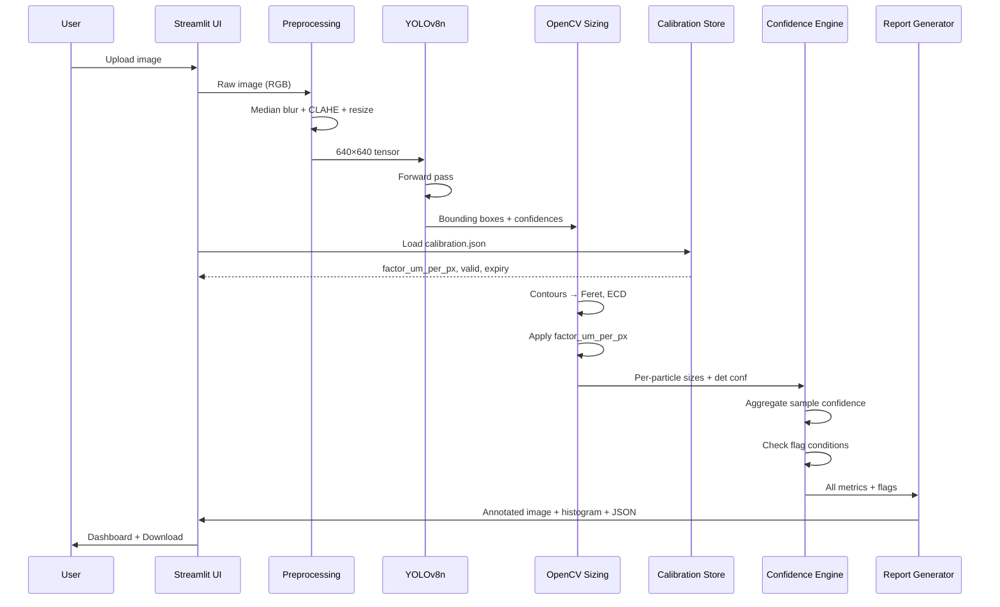
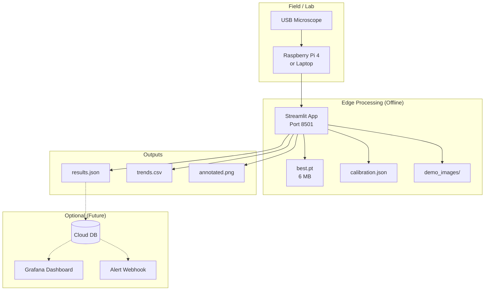

# System Flowchart — Hydro Lens

```mermaid
flowchart TD
    %% Styles
    classDef process fill:#e3f2fd,stroke:#1976d2,stroke-width:2px;
    classDef decision fill:#fff3e0,stroke:#f57c00,stroke-width:2px;
    classDef io fill:#e8f5e9,stroke:#388e3c,stroke-width:2px;
    classDef warning fill:#ffebee,stroke:#c62828,stroke-width:2px;
    classDef startend fill:#f3e5f5,stroke:#7b1fa2,stroke-width:2px;

    %% Nodes
    START([User Starts App]):::startend
    UPLOAD[Upload Microscope Image\nJPG/PNG/TIFF]:::io
    VALIDATE{Valid Image?}:::decision
    PREPROCESS[Preprocessing\n• Median Blur 3×3\n• CLAHE clipLimit=2.0\n• Letterbox 640×640]:::process
    CAL_CHECK{Valid Calibration\n< 7 days old?}:::decision
    CAL_WARN[⚠️ Calibration Missing/Stale\nQuantitative Output Blocked]:::warning
    CAL_OK[Load µm/px Factor\nValidation Beads ±20%]:::process
    INFERENCE[YOLOv8n Inference\nconf_thresh=0.25\nNMS iou=0.45]:::process
    DETECTIONS{Detections\nFound?}:::decision
    NO_DETS[Zero Particles\nConfidence=1.0]:::io
    SIZING[OpenCV Sizing per Box\n• Feret Max/Min\n• ECD\n• Aspect Ratio]:::process
    APPLY_CAL[Apply Calibration\npx → µm]:::process
    CONFIDENCE[Confidence Scoring\n• Mean Detection Conf\n• Calibration Quality\n• Coverage Factor]:::process
    FLAG_LOGIC{Flag Conditions?\n• conf < 0.6\n• cal invalid\n• size > 5mm\n• class∈{film,foam,pellet}\n• aspect_ratio > 10}:::decision
    FLAG_ON[🚩 Needs Lab Confirmation]:::warning
    FLAG_OFF[✅ Screening Reliable]:::process
    REPORT[Generate Report\n• Annotated Image\n• Size Histogram\n• Count + Distribution\n• Sample Confidence\n• Flags + Limitations Note]:::process
    EXPORT[Export JSON / CSV\nDownload / API]:::io
    END([Done]):::startend

    %% Edges
    START --> UPLOAD
    UPLOAD --> VALIDATE
    VALIDATE -- No --> UPLOAD
    VALIDATE -- Yes --> PREPROCESS
    PREPROCESS --> CAL_CHECK
    CAL_CHECK -- No --> CAL_WARN
    CAL_WARN --> INFERENCE
    CAL_CHECK -- Yes --> CAL_OK
    CAL_OK --> INFERENCE
    INFERENCE --> DETECTIONS
    DETECTIONS -- No --> NO_DETS
    NO_DETS --> REPORT
    DETECTIONS -- Yes --> SIZING
    SIZING --> APPLY_CAL
    APPLY_CAL --> CONFIDENCE
    CONFIDENCE --> FLAG_LOGIC
    FLAG_LOGIC -- Yes --> FLAG_ON
    FLAG_LOGIC -- No --> FLAG_OFF
    FLAG_ON --> REPORT
    FLAG_OFF --> REPORT
    REPORT --> EXPORT
    EXPORT --> END

    %% Subgraphs
    subgraph CALIBRATION ["Calibration Subsystem (Offline)"]
        MICROMETER[Stage Micrometer\n10 µm divisions]:::io
        BEADS[Polymer Beads\n10/50/100 µm]:::io
        COMPUTE[Compute µm/px Factor\nFFT or Manual Click]:::process
        VALIDATE_BEADS{Beads within\n±20%?}:::decision
        SAVE_CAL[Save calibration.json\nwith timestamp + expiry]:::io
        MICROMETER --> COMPUTE
        BEADS --> VALIDATE_BEADS
        COMPUTE --> VALIDATE_BEADS
        VALIDATE_BEADS -- Yes --> SAVE_CAL
        VALIDATE_BEADS -- No --> MICROMETER
    end

    CAL_OK -.-> CALIBRATION
    CAL_WARN -.-> CALIBRATION
```

---

## Detailed Pipeline Flow



---

## Calibration Flow (Standalone)



---

## Decision Logic: "Needs Lab Confirmation"

```mermaid
flowchart TD
    START_FLAG([Evaluate Particle]):::startend
    C1{Particle Conf\n< 0.5?}:::decision
    C2{Sample Conf\n< 0.6?}:::decision
    C3{Calibration\nInvalid?}:::decision
    C4{Size > 5000 µm?}:::decision
    C5{Class ∈\n{film,foam,pellet}?}:::decision
    C6{Aspect Ratio\n> 10?}:::decision
    FLAG_TRUE[🚩 NEEDS LAB\nCONFIRMATION]:::warning
    FLAG_FALSE[✅ Screening\nReliable]:::process

    START_FLAG --> C1
    C1 -- Yes --> FLAG_TRUE
    C1 -- No --> C2
    C2 -- Yes --> FLAG_TRUE
    C2 -- No --> C3
    C3 -- Yes --> FLAG_TRUE
    C3 -- No --> C4
    C4 -- Yes --> FLAG_TRUE
    C4 -- No --> C5
    C5 -- Yes --> FLAG_TRUE
    C5 -- No --> C6
    C6 -- Yes --> FLAG_TRUE
    C6 -- No --> FLAG_FALSE
```

---

## Data Flow: Image → JSON



---

## Deployment Topology



---

## Mermaid Rendering Notes

- Paste into any Markdown viewer with Mermaid support (GitHub, GitLab, Notion, Obsidian, VS Code with extension)
- For live demo: `markmap` or `mermaid-cli` can render to SVG/PNG
- Colors chosen for accessibility (colorblind-safe palette)

---

*Generated for HackMatrix 5.0 — Team Nishtha*